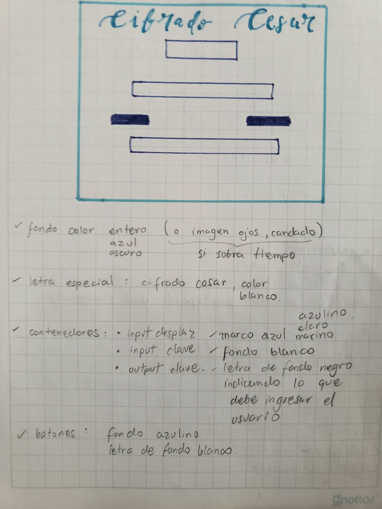

# Security Country

# Historia de Usuario

Un área gubernamental obliga a sus usuarios a cambiar sus contraseñas muy a menudo, a pesar de esto quieren implementar una aplicación para tener mayor seguridad con el loggin de sus usuarios.

Encriptado de claves

Los usuarios deberán ingresar sus nuevas claves a ser encriptadas, eligen la segmentación que desean. Al obtener la clave encriptada, lo utilizan en la web gubernamental. Tambien tienen la opción de desencriptar.
[linkPlanning](https://trello.com/b/NPCLDUsD/backlog)

# HTML

* Título
* Input de desplazamiento
* Input Clave
* Botones: cifrar y descifrar
* Output Nueva Clave

# CSS

* fondo: color azulino
* letra especial: color blanco
* contenedores: marco celeste, fondo blanco, letra de fondo negro indicando lo que debe ingresar el usuario
input desplaz
input clave
output clave

* botones: relleno celeste, letra de fondo blanco

# JS

* variables a declarar
num, 
string,
num%26,
stringUpperCase,
alphabet,
newString,

* funciones
cifrar,
descifrar,

* condicionales
for (crear un bucle en el recorrido del string)
if (indices mayores a 25)

* Métodos
.indexOf
.split
.toUpperCase
.chartAt
.charCodeAt